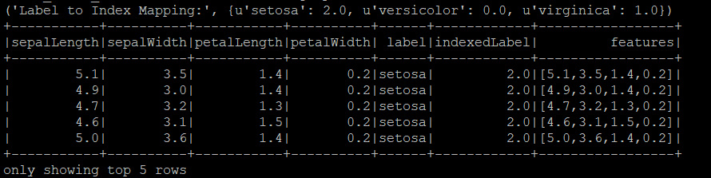
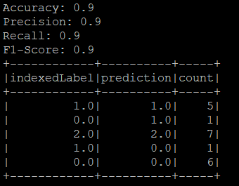
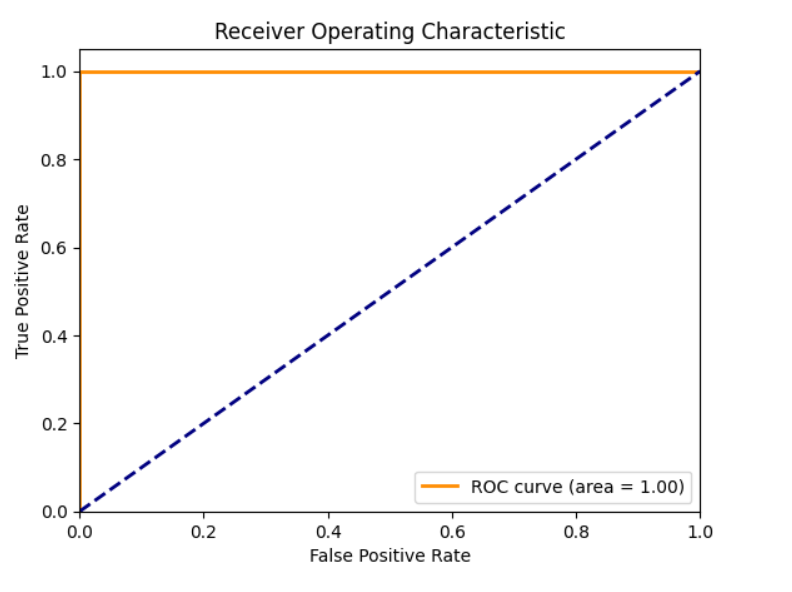

# <div align="center">Iris Classification with PySpark</div>

## <div align="center">

## Table of Contents

- [Introduction](#introduction)
- [Objectives](#objectives)
- [Methodology](#methodology)
- [Running the Code](#running-the-code)
- [Results](#results)
- [Visualizations](#visualizations)
- [Conclusion](#conclusion)

##  Introduction 

The Iris dataset that we got by extracting using R is a well-known dataset in the field of machine learning, often used for demonstrating classification algorithms. It contains measurements of three different species of iris flowers (setosa, versicolor, and virginica) with four features: sepal length, sepal width, petal length, and petal width. The goal of this project is to build a classification model using PySpark's MLlib to accurately predict the species of an iris flower based on these measurements.

##  Objectives 

1. Extract the Iris dataset from R
2. Load the Iris dataset into a Spark DataFrame.
3. Split the dataset into training and testing sets.
4. Select and implement a classification algorithm using Spark MLlib.
5. Employ techniques such as cross-validation and grid search to fine-tune hyperparameters.
6. Evaluate the performance of the tuned model using relevant evaluation metrics (accuracy, precision, recall, F1-score).

## Methodology

### Running the Code

**Running the Code Inside Putty**

   We are learning Apache Spark to explore Machine Learning concepts and applications. For this purpose, we are using PuTTY.
   
   ```sh
   from pyspark.sql import SparkSession
   from pyspark import SparkContext, SparkConf
   from pyspark.ml.feature import StringIndexer, VectorAssembler
   from pyspark.ml.classification import RandomForestClassifier
   from pyspark.ml.evaluation import MulticlassClassificationEvaluator
   from pyspark.ml.tuning import CrossValidator, ParamGridBuilder
   
   # Initialize Spark context and session
   conf = SparkConf().setAppName("Iris Classification")
   sc = SparkContext(conf=conf)
   spark = SparkSession(sc)

   # Load the Iris dataset
   iris_data = spark.read.csv("file:///home/maria_dev/azlin/iris.csv", header=True, inferSchema=True)

   # Rename the columns to mathc feature names
   iris_data = iris_data.withColumnRenamed("Sepal.Length","sepalLength")\
                     .withColumnRenamed("Sepal.Width","sepalWidth")\
                     .withColumnRenamed("Petal.Length","petalLength")\
                     .withColumnRenamed("Petal.Width","petalWidth")\
                     .withColumnRenamed("Species","label")

   # Index labels (convert string labels to numeric)
   indexer = StringIndexer(inputCol="label", outputCol="indexedLabel").fit(iris_data)
   iris_data = indexer.transform(iris_data)

   # Verify the label indexing
   label_to_index = {row['label']: row['indexedLabel'] for row in iris_data.select("label", "indexedLabel").distinct().collect()}
   print("Label to Index Mapping:", label_to_index)

   # Assemble features into a feature vector
   assembler = VectorAssembler(inputCols=["sepalLength","sepalWidth","petalLength","petalWidth"], outputCol="features")
   iris_data = assembler.transform(iris_data)

   # Show the first 5 rows
   iris_data.show(5)

   # Print
   iris_data.printSchema()
   ```
   >
   >
   > In Iris dataset, the label column contains string values such as "setosa", "versicolor", and "virginica". These are categorical labels that need to be converted to numeric indices so that they can be processed by the machine             learning model more efficiently.
   >
   > Above output shows 'setosa' was indexed as 2.0, 'versicolor' as 0.0, and 'virginica' as 1.0.
   >
   ```sh
   # Split the dataset into training and testing sets
   train_data, test_data = iris_data.randomSplit([0.8,0.2], seed=42)

   # Random Forest is selected as a classification algorithm
   randomForest = RandomForestClassifier(labelCol="indexedLabel", featuresCol="features")

   #Define a grid of hyperparameter to search over
   paramGrid = ParamGridBuilder()\
       .addGrid(randomForest.numTrees, [10,20,30])\
       .addGrid(randomForest.maxDepth, [5,10,15])\
       .build()

   # Use cross-validation to tune hyperparameters
   crossval = CrossValidator(estimator=randomForest,
                             estimatorParamMaps=paramGrid,
                             evaluator=MulticlassClassificationEvaluator(labelCol="indexedLabel", metricName="accuracy"),
                             numFolds=5)

   # Fit the model on the training data
   cv_model = crossval.fit(train_data)

   # Evaluate the model on the test data
   predictions = cv_model.transform(test_data)

   # Evaluate the performance of the model
   evaluator = MulticlassClassificationEvaluator(labelCol="indexedLabel", predictionCol="prediction")
   accuracy = evaluator.evaluate(predictions, {evaluator.metricName: "accuracy"})
   precision = evaluator.evaluate(predictions, {evaluator.metricName: "weightedPrecision"})
   recall = evaluator.evaluate(predictions, {evaluator.metricName: "weightedRecall"})
   f1 = evaluator.evaluate(predictions, {evaluator.metricName: "f1"})

   print("Accuracy: {}".format(accuracy))
   print("Precision: {}".format(precision))
   print("Recall: {}".format(recall))
   print("F1-Score: {}".format(f1))

   #Collect predictions to a pandas Dataframe for visualisation
   predictions.select("indexedLabel", "prediction").groupBy("indexedLabel","prediction").count().show()

   sc.stop()
   ```

**Run the PySpark script:**
   ```sh
   spark-submit Iris.py
   ```

## **Results**
**Confusion Matrix**



### **🔍 Analysis and Interpretation**

- Class 1.0 (virginica):
  - Correctly classified as 1.0 (virginica): 5 instances.
  - Incorrectly classified as 0.0 (versicolor): 1 instance.
- Class 0.0 (versicolor):
  - Correctly classified as 0.0 (versicolor): 6 instances.
  - Incorrectly classified as 1.0 (virginica): 1 instance.
- Class 2.0 (setosa):
  - Correctly classified as 2.0 (setosa): 7 instances.

## **Visualizations**

**Running the Code Inside Google Colab to have the visualisation**

**ROC Curve**

>
>
>**Insight:**
>
>The ROC curve and AUC score of 1.0 confirm that the model is extremely effective in distinguishing between the different classes of the Iris dataset. This high performance is consistent with the confusion matrix results and the metrics of accuracy, precision, recall, and F1-score. Together, they demonstrate that the Random Forest classifier is highly accurate and reliable for this dataset.

## **Conclusion**
The Random Forest classifier performed well on the Iris dataset, achieving high accuracy and balanced precision, recall, and F1-scores. 

**Specific Results Obtained**

- Accuracy: The model achieved an overall accuracy of 90%, indicating that 90% of the predictions made by the model were correct.

- Precision: The weighted precision of the model was 90%, indicating the percentage of positive identifications that were actually correct.

- Recall: The weighted recall of the model was 90%, indicating the percentage of actual positives that were correctly identified.

- F1-Score: The F1-score was 90%, representing the harmonic mean of precision and recall.

Overall, the model's performance demonstrates its effectiveness in classifying the iris species based on the given features, with high accuracy and balanced evaluation metrics.

💡 Tip: This analysis can be further extended by exploring additional classification algorithms, feature engineering, and further hyperparameter tuning to improve the model's performance.

# <div align="center">Enjoy 👍</div>

#### **Appendix**
   ```sh
   from pyspark.sql import SparkSession
   from pyspark import SparkContext, SparkConf
   from pyspark.ml.feature import StringIndexer, VectorAssembler
   from pyspark.ml.classification import RandomForestClassifier
   from pyspark.ml.evaluation import MulticlassClassificationEvaluator
   from pyspark.ml.tuning import CrossValidator, ParamGridBuilder

   # Initialize Spark context and session
   conf = SparkConf().setAppName("Iris Classification")
   sc = SparkContext(conf=conf)
   spark = SparkSession(sc)

   # Load the Iris dataset
   iris_data = spark.read.csv("file:///home/maria_dev/azlin/iris.csv", header=True, inferSchema=True)

   # Rename the columns to mathc feature names
   iris_data = iris_data.withColumnRenamed("Sepal.Length","sepalLength")\
                        .withColumnRenamed("Sepal.Width","sepalWidth")\
                        .withColumnRenamed("Petal.Length","petalLength")\
                        .withColumnRenamed("Petal.Width","petalWidth")\
                        .withColumnRenamed("Species","label")

   # Index labels (convert string labels to numeric)
   indexer = StringIndexer(inputCol="label", outputCol="indexedLabel").fit(iris_data)
   iris_data = indexer.transform(iris_data)

   # Verify the label indexing
   label_to_index = {row['label']: row['indexedLabel'] for row in iris_data.select("label", "indexedLabel").distinct().collect()}
   print("Label to Index Mapping:", label_to_index)

   # Assemble features into a feature vector
   assembler = VectorAssembler(inputCols=["sepalLength", "sepalWidth", "petalLength", "petalWidth"], outputCol="features")
   iris_data = assembler.transform(iris_data)

   # Show the first 5 rows
   iris_data.show(5)

   # Print
   iris_data.printSchema()

   # Split the dataset into training and testing sets
   train_data, test_data = iris_data.randomSplit([0.8,0.2], seed=42)

   # Random Forest is selected as a classification algorithm
   randomForest = RandomForestClassifier(labelCol="indexedLabel", featuresCol="features")

   #Define a grid of hyperparameter to search over
   paramGrid = ParamGridBuilder()\
       .addGrid(randomForest.numTrees, [10,20,30])\
       .addGrid(randomForest.maxDepth, [5,10,15])\
       .build()

   # Use cross-validation to tune hyperparameters
   crossval = CrossValidator(estimator=randomForest,
                             estimatorParamMaps=paramGrid,
                             evaluator=MulticlassClassificationEvaluator(labelCol="indexedLabel", metricName="accuracy"),
                             numFolds=5)

   # Fit the model on the training data
   cv_model = crossval.fit(train_data)

   # Evaluate the model on the test data
   predictions = cv_model.transform(test_data)

   # Evaluate the performance of the model
   evaluator = MulticlassClassificationEvaluator(labelCol="indexedLabel", predictionCol="prediction")
   accuracy = evaluator.evaluate(predictions, {evaluator.metricName: "accuracy"})
   precision = evaluator.evaluate(predictions, {evaluator.metricName: "weightedPrecision"})
   recall = evaluator.evaluate(predictions, {evaluator.metricName: "weightedRecall"})
   f1 = evaluator.evaluate(predictions, {evaluator.metricName: "f1"})

   print("Accuracy: {}".format(accuracy))
   print("Precision: {}".format(precision))
   print("Recall: {}".format(recall))
   print("F1-Score: {}".format(f1))
   
   #Collect predictions to a pandas Dataframe for visualisation
   predictions.select("indexedLabel", "prediction").groupBy("indexedLabel","prediction").count().show()

   sc.stop()

   ```
